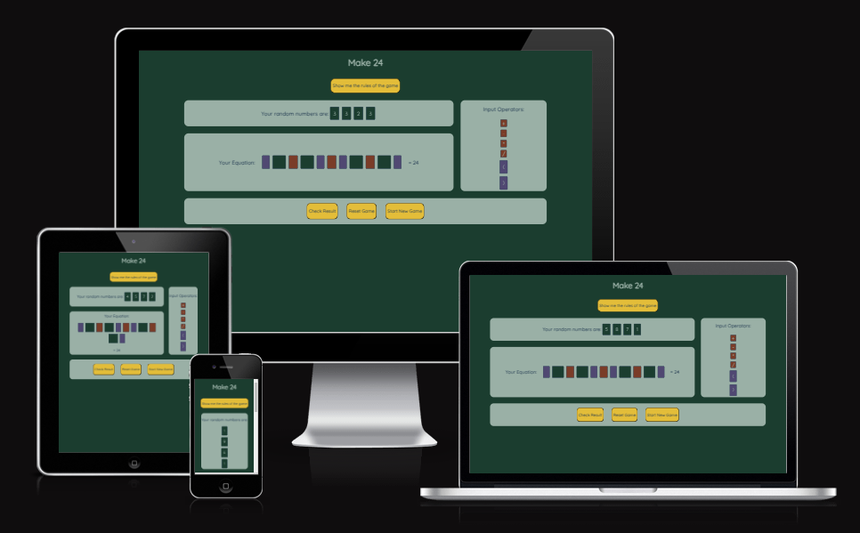
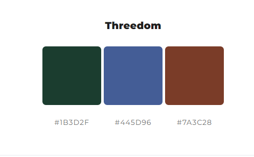
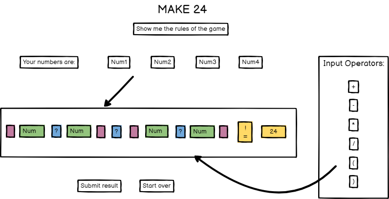
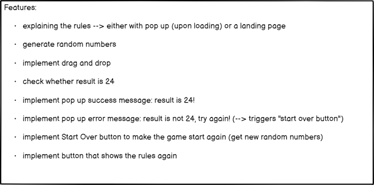
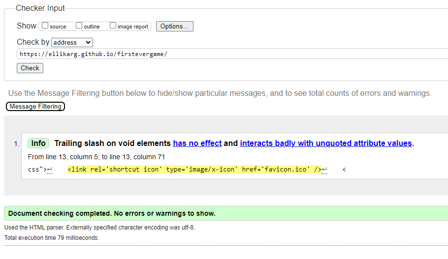
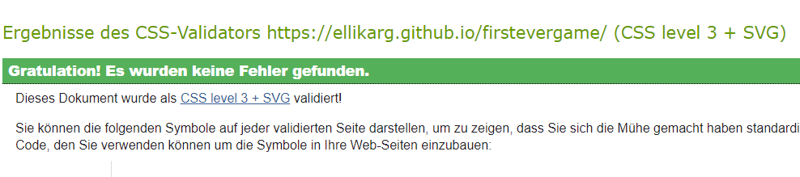
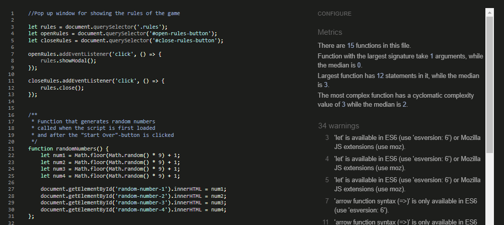
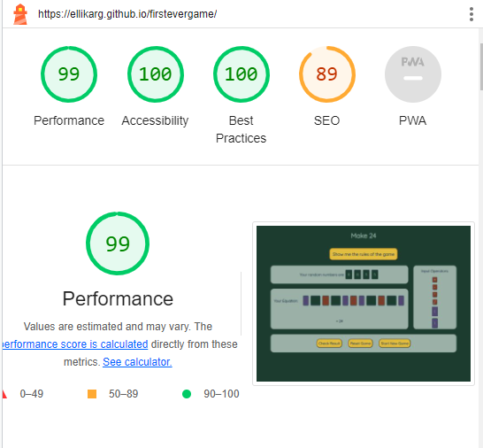
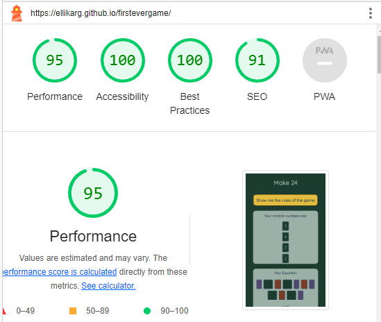

# Make 24

Mockup Image

[Live Webpage](https://ellikarg.github.io/firstevergame/)

## Table of Content

1. [Project Goals](#project-goals)
    1. [User Goals](#user-goals)
    2. [Site Owner Goals](#site-owner-goals)
2. [User Experience](#user-experience)
    1. [Target Audience](#target-audience)
    2. [User Requirements and Expectations](#user-requirements-and-expectations)
    3. [User Stories](#user-stories)
    4. [Site Owner Stories](#site-owner-stories)
3. [Design](#design)
    1. [Colours](#colours)
    2. [Fonts](#fonts)
    3. [Structure](#structure)
    4. [Wireframes](#wireframes)
4. [Technologies Used](#technologies-used)
    1. [Languages](#languages)
    2. [Frameworks & Tools](#frameworks-&-tools)
5. [Validation](#validation)
    1. [HTML Validation](#HTML-validation)
    2. [CSS Validation](#CSS-validation)
    3. [JavaScript Validation](#javascript-validation)
    4. [Accessibility & Performance](#accessibility-&-performance)
    6. [Device testing](#performing-tests-on-various-devices)
6. [Bugs](#Bugs)
7. [Deployment](#deployment)
8. [Credits](#credits)
9. [Acknowledgments](#acknowledgments)

## Project Goals
Make 24 is a game for puzzling over a mathematical equation. If you use the right operators, 4 random numbers between 1 and 9 will always result in the magical number, 24!

### User Goals
- Playing a fun mathematical game for yourself
- getting better at the maths basics which we hardly use anymore in our daily life if we don't work with anything regarding maths!

### Site Owner Goals
- Creating a fun and challenging game that users will want to play again and again while at the same time improving making simple calculations in their heads
- The game should be fully responsive and able to be played on different devices.

## User Experience

### Target Audience
- casual gamers
- people who like maths games
- peolpe who are looking for a quick but challenging game

### User Requirements and Expectations
- A simple and intuitive navigation system
- Easy and fun to play
- Links and functions that work as expected
- Good presentation and a visually appealing design regardless of screen size
- Accessibility

### User Stories
1. As a user, I want to be able to test my maths capabilities by calculating and testing simple equations in my head
2. As a user, I want to be able to drag and drop the random numbers, the operators and brackets in the equation area
3. As a user, I want to be able to submit the result when I am content with my equation
4. As a user, I want to get feedback whether the equation really resulted in the magic number 24
5. As a user, I want to be able to reset the equation to an empty area and start from the beginning
6. As a user, I want to be able to start the game over with new random numbers in case I get completly stuck and want to give up and try with a new set of numbers

### Site Owner Stories
7. As a site owner, I want users to be able to enjoy the game and navigate the game area intuitively
8. As a site owner, I want users to be able to understand the rules of the game quickly

## Design

### Design Choices

### Colours
The colour palette was chosen to match the flowery theme of the background image. A color picker was used to pick colors from the background image, these colors were then further adjusted to meet accessibility criteria. 

Colour palette

### Fonts
I used the google font "Quicksand", which is part of the sans-serif-family, for easy readability in the weight 400. 

### Structure
The page is structured in a user-friendly way and has only one main page, which is divided into different areas.

- A homepage with 3 different areas:
    - the rules pop up window
    - the gaming area with random numbers, the equation and the input areas
    - the buttons area to check the result, to reset the game or to start a new game.

### Wireframes

Game screen

Initial Ideas for features

## Technologies Used

### Languages
- HTML
- CSS
- JavaScript

### Frameworks & Tools
- Git
- GitHub
- Codeanywhere
- Balsamiq
- Font Awesome
- Favicon.io
- mycolor.space
- W3C Markup validation service
- W3C Jigsaw CSS validation service
- JSHint
- Lighthouse

## Features
Gaming page:
1. Pop up window to show the rules of the game
2. Random numbers: function math.random used in the script.js file to pick 4 random numbers from 1 to 9, drag elements to be put in the dropzone (equation)
3. Equation: dropzone for the random numbers and input operators, javascript function checks whether the result euqals 24
4. Input Operators: drag elements to be put in the dropzone (equation)
5. Three buttons: one to check if the result is correct, one to reset the game and therefore empty the equation area and one for starting a new gamewith new random numbers

## Validation

### HTML Validation
The W3C Markup Validation Service was used to validate the HTML of the website. All pages pass with no errors no warnings to show.

Main page

### CSS Validation
The W3C Jigsaw CSS Validation Service was used to validate the CSS of the website. There were no errors or warnings shown.

Main page

### JavaScript Validation
I used JSHint Static Code Analysis Tool for JavaScript to validate the Javascript files. No significant erorrs were found. There were warnings, but they were all about JS extensions for the Mozilla browser.

Main Page

### Accessibility & Performance 
Google Lighthouse in Google Chrome Developer Tools was used to test the accessibility and performance of the website.

For Desktop

For Mobile Devices

### Performing tests on various devices 
The website was tested on the following devices:

- Dell Latitude E7240 (Chrome)
- Huawei P30 light (Chrome)

In addition, the website was tested using the Google Chrome Developer Tools Device Toggling option for all available device options.

## Bugs

| **Bug** | **Fix** |
| ----------- | ----------- |
| The equation area has overflow on smaller screen sizes | Change padding and margin sizes for smaller screens |
| The equation would wrap one by one, leaving it difficult to interpret it as an equation | Using another flex-container just for the numbers and operators |
| The drag and drop function would add characters as a string when dropping an element there more than once | using the .replaceChildren() method instead of the .append() method |
| checkResult function did not get the value of the divs to interpret them as numbers and operators  | using the eval() method although it is not advised to do this without security checks beforehand |

## Deployment
The website was deployed using GitHub Pages by following these steps:
1. In the GitHub repository navigate to the Settings tab
2. On the left-hand menu select Pages
3. For the source select Branch: main
4. Press "save"
5. After a view minutes and a refresh of the page you will find the link to your site at the top: "Your site is published at https://ellikarg.github.io/firstevergame/

You can fork the repository by following these steps:
1. Go to the GitHub repository
2. Click on Fork button in the upper right hand corner

You can clone the repository by following these steps:
1. Go to the GitHub repository 
2. Locate the Code button above the list of files and click it 
3. Select if you prefer to clone using HTTPS, SSH, or Github CLI and click the copy button to copy the URL to your clipboard
4. Open Git Bash
5. Change the current working directory to the one where you want the cloned directory
6. Type git clone and paste the URL from the clipboard ($ git clone https://github.com/YOUR-USERNAME/YOUR-REPOSITORY)
7.Press Enter to create your local clone.

## Credits
The layout was created by the developer

### Media
There was no media used for this game

### Code
- inspiration from the sample project of the course (love maths game) in order to get going!
- stackoverflow for any doubts about javascript functionality and usage of variables and functions
- readme layout: https://github.com/4n4ru/CI-P2-GuessingBee
- css: setting global variables (border-radius): https://www.youtube.com/watch?v=68O6eOGAGqA
- javascript: pop up window for the rules of the game: https://www.youtube.com/watch?v=TAB_v6yBXIE
- javascript: drag and drop code partly from https://www.youtube.com/watch?v=Pje43sNdsaA

## Acknowledgments

I would like to thank a few people who helped me get through this project:
- my Mentor for the support and pacience
- Ed, a tutor, who really helped me to get a function right when I was stuck
- Alessio, a friend of mine, who cooked for me in the last days before the deadline of the project :D
