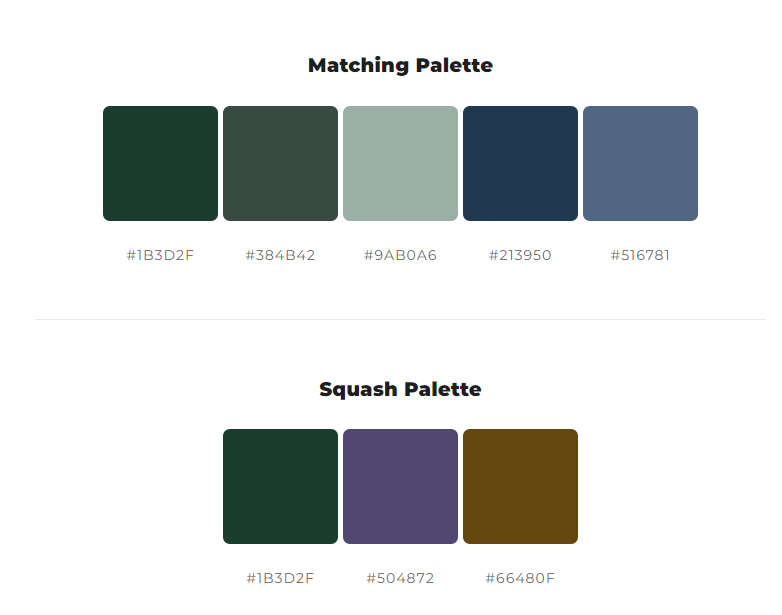

# Make 24

Mockup Image

[Live Webpage](https://ellikarg.github.io/firstevergame/)

## Table of Content

1. [Project Goals](#project-goals)
    1. [User Goals](#user-goals)
    2. [Site Owner Goals](#site-owner-goals)
2. [User Experience](#user-experience)
    1. [Target Audience](#target-audience)
    2. [User Requirements and Expectations](#user-requirements-and-expectations)
    3. [User Stories](#user-stories)
    4. [Site Owner Stories](#site-owner-stories)
3. [Design](#design)
    1. [Design Choices](#design-choices)
    2. [Colour](#colours)
    3. [Fonts](#fonts)
    4. [Structure](#structure)
    5. [Wireframes](#wireframes)
4. [Technologies Used](#technologies-used)
    1. [Languages](#languages)
    2. [Frameworks & Tools](#frameworks-&-tools)
5. [Features](#features)
6. [Testing](#validation)
    1. [HTML Validation](#HTML-validation)
    2. [CSS Validation](#CSS-validation)
    3. [JavaScript Validation](#javascript-validation)
    4. [Accessibility](#accessibility)
    5. [Performance](#performance)
    6. [Device testing](#performing-tests-on-various-devices)
    7. [Browser compatibility](#browser-compatability)
    8. [Testing user stories](#testing-user-stories)
8. [Bugs](#Bugs)
9. [Deployment](#deployment)
    1. [EmailJS API](#emailjs-api)
10. [Credits](#credits)
11. [Acknowledgments](#acknowledgments)

## Project Goals 
Make 24 is a game for puzzling over a mathematical equation. If you use the right operators, 4 random numbers between 1 and 9 will always result in the magical number, 24!

### User Goals
- Playing a fun mathematical game for yourself
- getting better at the maths basics which we hardly use anymore in our daily life if we don't work with anything regarding maths!

### Site Owner Goals
- Creating a fun and challenging game that users will want to play again and again while at the same time improving making simple calculations in their heads
- The game should be fully responsive and able to be played on different devices.

## User Experience

### Target Audience
- casual gamers
- people who like maths games
- peolpe who are looking for a quick but challenging game

### User Requirements and Expectations
- A simple and intuitive navigation system
- Easy and fun to play
- Links and functions that work as expected
- Good presentation and a visually appealing design regardless of screen size
- Accessibility

### User Stories
1. As a user, I want to be able to test my maths capabilities by calculating and testing simple equations in my head
2. As a user, I want to be able to drag and drop the random numbers, the operators and brackets in the equation area
3. As a user, I want to be able to submit the result when I am content with my equation
4. As a user, I want to get feedback whether the equation really resulted in the magic number 24
5. As a user, I want to be able to reset the equation to an empty area and start from the beginning
6. As a user, I want to be able to start the game over with new random numbers in case I get completly stuck and want to give up and try with a new set of numbers

### Site Owner Stories
7. As a site owner, I want users to be able to enjoy the game and navigate the game area intuitively
8. As a site owner, I want users to be able to understand the rules of the game quickly

## Design

### Design Choices

### Colour
The colour palette was chosen to match the flowery theme of the background image. A color picker was used to pick colors from the background image, these colors were then further adjusted to meet accessibility criteria. 

Colour palette

### Fonts
I used the google font "Quicksand", which is part of the sans-serif-family, for easy readability in the weight 400. 

### Structure
The page is structured in a user-friendly way and has only one main page, which is divided into different areas.

- A homepage with 3 different areas:
    - the rules pop up window
    - the gaming area with random numbers, the equation and the input areas
    - the buttons area to check the result, to reset the game or to start a new game.

### Wireframes

Game screen

Initial Ideas for features

## Technologies Used

### Languages
- HTML
- CSS
- JavaScript

### Frameworks & Tools
- Git
- GitHub
- Gitpod
- Balsamiq
- Font Awesome
- Favicon.io
- mycolor.space

- JSHint
- Lighthouse
- W3C Markup validation service
- W3C Jigsaw CSS validation service 
- WAVE WebAIM web accessibility evaluation tool
- EmailJS

## Features
Gaming page:
1. Pop up window to show the rules of the game
2. Random numbers: function math.random used in the script.js file to pick 4 random numbers from 1 to 9, drag elements to be put in the dropzone (equation)
3. Equation: dropzone for the random numbers and input operators, javascript function checks whether the result euqals 24
4. Input Operators: drag elements to be put in the dropzone (equation)
5. Three buttons: one to check if the result is correct, one to reset the game and therefore empty the equation area and one for starting a new gamewith new random numbers

## Validation

### HTML Validation
The W3C Markup Validation Service was used to validate the HTML of the website. All pages pass with no errors no warnings to show.

Home

Contact Us

404

### CSS Validation
The W3C Jigsaw CSS Validation Service was used to validate the CSS of the website. When validating the page as a whole, the validator shows some errors linked to Bootstrap v5.0. When validating just my custom CSS it passes with no errors.

Full page

style.css

### JavaScript Validation
JSHint Static Code Analysis Tool for JavaScript was used to validate the Javascript files. No significant issues were found.

game-settings.js

guessing-be.js

contact.js

### Accessibility
The WAVE WebAIM web accessibility evaluation tool was used to ensure the website met high accessibility standards. All pages pass with 0 errors.

Home

Contact

404

### Performance 
Google Lighthouse in Google Chrome Developer Tools was used to test the performance of the website.

Home

Contact

404

### Performing tests on various devices 
The website was tested on the following devices:

- Lenovo Yoga 2 Pro (both in pc and tablet mode)
- Honor 20 pro
- Xiaomi Redmi Note 7

In addition, the website was tested using the Google Chrome Developer Tools Device Toggling option for all available device options.

### Browser Compatability
The website was tested on the following browsers:

- Google Chrome
- Mozilla Firefox
- Microsoft Edge

### Testing user stories

1. As a user, I want to be able to pick a difficulty for the game

| **Feature** | **Action** | **Expected Result** | **Actual Result** |
|-------------|------------|---------------------|-------------------|
| Start screen | Click on the desired difficulty | The games screen loads with the desired difficulty | Works as expected |

Screenshots

2. As a user, I want to test my general knowledge by guessing different phrases

| **Feature** | **Action** | **Expected Result** | **Actual Result** |
|-------------|------------|---------------------|-------------------|
| Game screen | Click the alphabet buttons or use your keyboard to guess letters and reveal the correct answer | Either the phrase displayed or the image change depending on if your guess is correct or wrong | Works as expected |

Screenshots

3. As a user, I want to be able to pick the letters both by clicking the mouse and by using the keyboard

| **Feature** | **Action** | **Expected Result** | **Actual Result** |
|-------------|------------|---------------------|-------------------|
| Game screen | Click the alphabet buttons or use your keyboard | The used letters change color and can't be picked a second time | Works as expected |

Screenshots

4. As a user, I want to know what the correct phrase was in case I don't guess it correctly

| **Feature** | **Action** | **Expected Result** | **Actual Result** |
|-------------|------------|---------------------|-------------------|
| Game over screen | Run out of moves | The game over screen with the correct answer is displayed | Works as expected |

Screenshots

5. As a user, I want feedback on my correct answers

| **Feature** | **Action** | **Expected Result** | **Actual Result** |
|-------------|------------|---------------------|-------------------|
| Correct guess screen | Complete the phrase before you run out of moves | The correct message is displayed | works as expected |

Screenshots

6. As a user, I want confirmation that my feedback was sent

| **Feature** | **Action** | **Expected Result** | **Actual Result** |
|-------------|------------|---------------------|-------------------|
| Form confirmation | Fill out the contact form and click the submit button | A thank you message is displayed | Works as expected | 

Screenshots

7. As a site owner, I want users to be able to contact us or make suggestions for new phrases.

| **Feature** | **Action** | **Expected Result** | **Actual Result** |
|-------------|------------|---------------------|-------------------|
| Contact form | Scroll down to the footer section and click the contact us link | Displays the contact form | Works as expected |

Screenshots

8. As a site owner, I want users to be able to find us on social media.

| **Feature** | **Action** | **Expected Result** | **Actual Result** |
|-------------|------------|---------------------|-------------------|
| Footer | Scroll down to the footer section | See social media links | Works as expected |

Screenshots

## Bugs

| **Bug** | **Fix** |
| ----------- | ----------- |
| The score doesn't reset after the game is restarted | Add score reset to showStartScreen function |
| The phrase that needs to be guessed jumps around after each correct letter picked | Change font to monospace |
| On the correct screen, the total score is shown instead of the round score | Set the HTML to roundScore instead of score |
| Checking correct guess is not working for uppercase letters when clicking keyboard | call the toUpperCase function on key |
| The game container is not centered for some screen sizes | Using Bootstrap center the container for all screen sizes |
| Alphabet buttons don't change color after they are clicked | Remove the my-btn class after the click event is fired |
| Social media links are not visible on contact and 404 page | Add missing FontAwesome kit to the pages |
| On some tablets, whitespace below the footer appears | Add CSS to make the pages min-height: 100vh and allow the main element to grow, but not to shrink |
| The contact page has overflow on smaller screen sizes | Change padding and margin sizes for smaller screens |

## Deployment
The website was deployed using GitHub Pages by following these steps:
1. In the GitHub repository navigate to the Settings tab
2. On the left-hand menu select Pages
3. For the source select Branch: main
4. Press "save"
5. After a view minutes and a refresh of the page you will find the link to your site at the top: "Your site is published at https://ellikarg.github.io/firstevergame/

You can fork the repository by following these steps:
1. Go to the GitHub repository
2. Click on Fork button in the upper right hand corner

You can clone the repository by following these steps:
1. Go to the GitHub repository 
2. Locate the Code button above the list of files and click it 
3. Select if you prefer to clone using HTTPS, SSH, or Github CLI and click the copy button to copy the URL to your clipboard
4. Open Git Bash
5. Change the current working directory to the one where you want the cloned directory
6. Type git clone and paste the URL from the clipboard ($ git clone https://github.com/YOUR-USERNAME/YOUR-REPOSITORY)
7.Press Enter to create your local clone.

## Credits
The layout was created by the developer.

### Media
There was no media used for this game

### Code
- inspiration from the sample project of the course (love maths game) in order to get going!
- stackoverflow for any doubts about javascript functionality and usage of variables and functions
- readme layout: https://github.com/4n4ru/CI-P2-GuessingBee
- css: setting global variables (border-radius): https://www.youtube.com/watch?v=68O6eOGAGqA
- javascript: pop up window for the rules of the game: https://www.youtube.com/watch?v=TAB_v6yBXIE
- javascript: drag and drop code partly from https://www.youtube.com/watch?v=Pje43sNdsaA

## Acknowledgments

